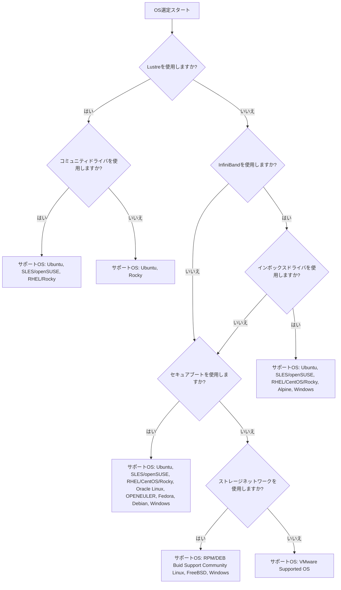
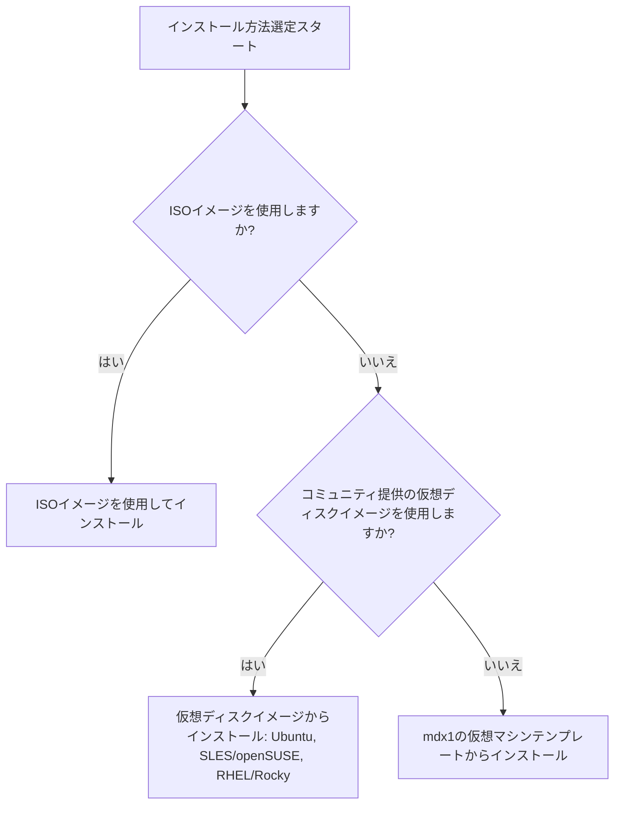

- [はじめに](#はじめに)
- [mdx1の仕様](#mdx1の仕様)
  - [mdx1以外の構成要件](#mdx1以外の構成要件)
- [OSの制約](#osの制約)
- [チェックリスト](#チェックリスト)
  - [デスクトップ用途の場合](#デスクトップ用途の場合)
- [フローチャート1: mdx1の制約によるOS選定](#フローチャート1-mdx1の制約によるos選定)
- [フローチャート2: インストール方法](#フローチャート2-インストール方法)
- [備考](#備考)
  - [セキュアブートを有効化した場合の注意点](#セキュアブートを有効化した場合の注意点)
  - [事後に設定可能な項目かどうか](#事後に設定可能な項目かどうか)
  - [ドライバをソースコードからビルド](#ドライバをソースコードからビルド)

# はじめに
mdx1で採用するOSの勘所のメモ。

仮想マシン(VM)を使用するため、オンプレミスの環境よりも柔軟にOSを選択することができるが、制約条件も存在する。

mdx1に備えられているハードウェアや共有ファイルシステム、ドライバの機能をフルサポートされているOSを選ぼうとすると、選択肢は限られる。

一方で、一部の性能や機能について折り合いをつけて、OSで提供されている機能を優先する場合は、選択可能なOSの種類も増える。
また、限られたOSで無理やり欲しい機能を動かしたり、導入するための開発コストを負担することのほうが、ハードウェアの機能を犠牲にすることよりも高くなる可能性もある。
mdx1の制約と、OSの選択肢を把握することで、利用者側でVMの柔軟性を活かせるようになる。

本稿では、これまでの検証結果を元に、OS選択について記す。

# mdx1の仕様
- CPU: インテル® Xeon® Platinum 8368 プロセッサー
- GPU: NVIDIA A100 Tensor
- ストレージコントローラ: PVSCSI
- ネットワーク: VMXNET3, SR-IOV
  - 仮想NIC: 仮想ネットワークドライバ(VMXNET3)
  - SR-IOV: ConnectX mlx5ドライバ, InfiniBand
- 共有ストレージ: Lustreファイルシステム

## mdx1以外の構成要件
- セキュリティソフトの有無
- 機関で指定のソフトウェアがある等

# OSの制約
ドライバの提供の有無に掛かっている。
CPUはx86_64アーキテクチャなので、ほとんどのOSについて問題はないが、GPUやSR-IOV, Lustreについては専用のドライバの提供がなされているかどうかで、OSの選択肢が狭まる。

特にLustreについては、コミュニティから以下のOSのみの提供となっている。

- Ubuntu
- RHEL(Rocky)
- SLES(openSUSE)

GPUやネットワークドライバについて、NVIDIA公式のドライバーダウンロード以外に、ディストリビューションの公式リポジトリから、ディストリビューション向けにビルドされたドライバが提供されている場合もある。
コンパイルすべきかどうかは、使用する前に検討したほうが良い。
ストレージネットワークを使用しないか、InfiniBandを使用しない場合は、仮想NICを選択する
仮想NICはほとんどのOSのデフォルトで組み込まれているドライバである、VMXNET3が選択される。

注意しないといけないのが、VMで定義されているストレージコントローラである。
OVF経由でコントローラを設定しないといけない。
デフォルトだと、LSI Logicがだが、LSI LOGIC SASやPVSCSIを使用したい場合は、OVFを編集して、インポートする必要がある。

PVSCSIを選択した状態で、Windowsをインストールしようとすると、ウィザードの途中でドライバをインストールしないといけない。
ドライバーはVMware ToolsのISOからインストールする必要がある。
Linuxの場合は、自動選択される。

# チェックリスト
OS選定に関わるVMの要素について以下のチェックリストにまとめる。

以下のチェックリストは、サーバを前提とした場合である。

- [ ] Lustreファイルシステムを使用する
  - [ ] コミュニティドライバを使用する
    - [ ] バイナリを利用する
    - [ ] ソースコードからビルドする
  - [ ] mdx1で提供されているドライバを使用する
- [ ] Infiniband (SR-IOV) を使用する
  - [ ] Linux付属インボックスドライバを使用する
  - [ ] ドライバをビルドしてインストールする
- [ ] セキュアブートを使用する
- [ ] ストレージネットワーク使用する
- [ ] インストールにISOイメージを使うか？
- [ ] VM用の仮想ディスクイメージを使うか？

OSの使い勝手や、設定ツールの良し悪しなど、ディストリビューションのエコシステムについては考慮せず、mdx1環境の制約によって、使用可能なOSの候補は狭まれる。

## デスクトップ用途の場合
デスクトップとして使用する場合、セキュアブートやセキュリティソフトが必須となり、商用Linux以外の選択肢がなくなる。

- [ ] デスクトップとして使用する
- [ ] 特定のソフトウェアを使用する(セキュリティソフト)

# フローチャート1: mdx1の制約によるOS選定
上記のチェックリストから、サーバ用途で大まかな選択肢は以下のようになる。

# フローチャート2: インストール方法
選定したOSからインストール方法による選別

# 備考
## セキュアブートを有効化した場合の注意点
VMが起動不能になったり、なんらかの障害対応でCDブートが必要な際に、ディストリビューションから提供されているLiveイメージに限定される。

一般的に広く使われる、レスキュー用のLinuxイメージだとブートできない可能性がある。

トラブル発生時の、復旧手順を確認しておくこと。

## 事後に設定可能な項目かどうか
InfiniBandのドライバについては、運用後に追加することが可能であるが、Lustreとセキュアブートについては、対応しているOS以外は不可能である。

そのため、OSを選定してから、後で追加や設定の変更の可能性がある場合は、Lustreが利用可能なOSと共通化しておく方が、安定的な運用ができる。

一方で、特定の用途に限ったアプライアンスや、オンプレミスからの移行を検討する場合は、考慮外となる。リフト&シフトをする場合でも、mdx1の機能を制限することで、他のOSを動かすことは可能である。

## ドライバをソースコードからビルド
コミュニティからドライバが提供されていないOSで、ドライバを動かす方法として、ソースビルドする方法がある。
この方法を採用する場合は、ビルド用の環境を用意する必要がある。
VM上でローカルビルドを行う場合、必要なVMの数だけ環境を用意する必要がある。
ビルド用の開発パッケージをインストール用のストレージスペースと、ビルド用のリソースを割当てる必要がある。
またビルドする時間や手間を考えると、VMの数だけコストが増加する。

ビルド用のVMを専用で用意し、バイナリを他のVMへ展開するほうが効率的だが、ビルド用のVMを設計してメンテナンスする必要がある。
この場合、VMにおけるOSや、依存パッケージのバージョンを一致させておく必要がある。
日常的なアップデートやセキュリティ的な緊急アップデートを含めて、パッケージの一貫性を保つ必要がある。

いずれにせよ、使用リソースとメンテナンスの計画を策定しておく必要がある。